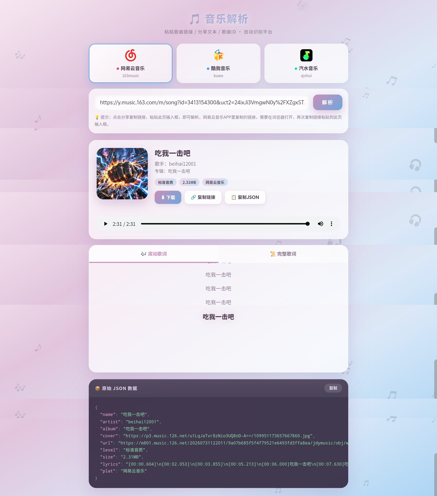

# 音乐解析api

# ！声明 ！
本项目为开源软件，遵循MIT许可证。任何个人或组织均可自由使用、修改和分发本项目的源代码。然而，我们明确声明，本项目及其任何衍生作品不得用于任何商业或付费项目。任何违反此声明的行为都将被视为对本项目许可证的侵犯。我们鼓励大家在遵守开源精神和许可证的前提下，积极贡献和分享代码。

## 🚀 项目简介
本工具用于解析音乐真实链接，获取音乐的详细信息，如音乐地址、封面图、作者信息等。

## ✨ 功能特点
- 支持多种音乐平台的链接解析
  - 🎵 网易云音乐（163music.php）
  - 🎶 酷我音乐（kuwo.php）
  - 🎧 汽水音乐（qsmusic.php + dymusic.php）
- 支持三种输入方式：**完整链接** · **复制的分享文本**（自动提取链接）· **纯歌曲ID**
- 自动识别平台并切换解析通道
- 返回结构化的 JSON 数据
- 提供可直接访问的聚合解析页面（index.php），支持在线播放、下载、复制链接、复制 JSON、歌词滚动/完整展示

## 🖥️ 解析平台页面（index.php）

项目内置一个开箱即用的**聚合解析网页**，无需额外部署即可使用。



### 页面功能
- **平台选择**：顶部三张卡片（网易云音乐 / 酷我音乐 / 汽水音乐），点击即可切换当前解析平台
- **输入解析**：粘贴链接或分享文本，或输入纯歌曲 ID，点击「解析」按钮
- **自动识别**：粘贴任意平台链接时自动识别并切换对应平台
- **歌曲展示**：封面、歌名、歌手、专辑、音质、大小、平台
- **在线播放**：内置音频播放器，直接试听
- **快捷操作**：下载音频 / 复制音频链接 / 复制解析 JSON
- **歌词**：支持滚动歌词与完整歌词两种视图

### 页面截图说明
上图为页面实际运行效果（粉蓝渐变主题）：顶部为三个平台卡片，中部为输入框与解析按钮，下方为歌曲信息、播放器、歌词及 JSON 数据区域。

## 🔧 如何更新解析平台页面

### 1. 修改平台卡片（index.php）
在 `index.php` 的「平台选择」区域（`.platforms` 容器内）添加或修改卡片：

```html
<div class="pf" data-pf="平台标识" onclick="selectPf('平台标识')">
  <span class="ico"><!-- 平台图标(SVG/Emoji) --></span>
  <span class="nm"><span class="dot dot-平台标识"></span>平台名称</span>
  <span class="ds">平台代号</span>
</div>
```

同步在 CSS 中补充对应的圆点颜色，例如：
```css
.dot-平台标识{background:#颜色}
```

### 2. 添加平台识别规则（index.php）
在 `detectPlatform(url)` 函数中注册该平台的域名匹配：

```js
if(/平台域名/.test(url)) return '平台标识';
```

### 3. 编写解析函数（index.php）
在 JS 中仿照 `parseNetease` / `parseKuwo` / `parseQishui` 新增 `parse平台标识(url)`，并接入主流程：

```js
if(PLATFORM==='平台标识') norm = await parse平台标识(url);
```

### 4. 新增后端解析文件
为平台新建独立的 PHP 解析接口（如 `xxxmusic.php`），返回标准化 JSON，并在前端 `fetch` 调用。参考现有：
- 网易云：`163music.php`（接口：`163music.php?type=music&url=链接或ID`）
- 酷我：`kuwo.php`（接口：`kuwo.php?url=播放页链接`）
- 汽水：`qsmusic.php` + `dymusic.php`（接口：`qsmusic.php?url=分享链接`）

### 5. 纯 ID 快捷解析（index.php）
若平台支持纯歌曲 ID 输入，在 `doParse()` 中补充构造链接逻辑：

```js
else if(PLATFORM==='平台标识') url = 'https://平台播放页/'+raw;
```

> 💡 修改后建议在浏览器中刷新页面验证：切换平台、解析、播放、下载、歌词展示是否全部正常。

## 📦 安装与部署

### 1. 下载代码

```
git clone https://github.com/beihaiBH/music_jx.git

cd music_jx
```

### 2. 直接使用（无需安装）

将 `xxx.php` 上传至 Web 服务器，通过 URL 访问：
```
http://你的服务器地址/xxx.php?url=目标链接
```
### 请求参数
| 参数名 | 类型 | 描述 | 是否必填 |
| ---- | ---- | ---- | ---- |
| url | 字符串 | 短视频平台的视频链接 | 是 |

### 请求示例
```plaintext
https://api.bugpk.com/api/kuwo?url=https://www.kuwo.cn/play_detail/382383309
```
### 请求结果
```plaintext
{
    "code": 200,
    "message": "成功",
    "data": {
        "song_id": 382383309,
        "title": "情没有对错",
        "artist": "鱼蛋",
        "album": "情没有对错",
        "pic": "https://img2.kuwo.cn/star/albumcover/500/s4s57/45/4185451017.png",
        "releaseDate": "2024-06-18",
        "albumpic": "https://img2.kuwo.cn/star/albumcover/500/s4s57/45/4185451017.png",
        "songTimeMinutes": "04:17",
        "pic120": "https://img2.kuwo.cn/star/albumcover/120/s4s57/45/4185451017.png",
        "albuminfo": "缘分哪有对或错\n前路纵冷冷的过\n没法潇洒怎么经起 这风浪",
        "music_url": "https://er-sycdn.kuwo.cn/15b1e0761817d178c45b55728a2da98d/68318e49/resource/30106/trackmedia/M800001TBYUG4SnYmS.mp3",
        "lyrics_url": "[00:00.160]情没有对错 - 鱼蛋\n[00:01.480]词：纬盈\n[00:02.090]曲：郑建浩\n[00:02.890]编曲：吕小毅\n[00:03.800]吉他：吕小毅\n[00:04.740]制作人：郑建浩\n[00:05.850]和声：姚斯婷\n[00:06.800]录音师：洛斯李\n[00:07.930]录音工作室：广州Star Music Studio\n[00:09.710]监制：郑建浩\n[00:10.690]混音/母带处理：林子豪\n[00:12.280]艺人统筹：文豪\n[00:13.420]营销策划：孙悦/刘彬@噼里啪啦\n[00:15.500]出品人：雲笙\n[00:16.530]出品团队：犇犇工作室\n[00:18.140]未经著作权人书面许可，不得以任何方式（包括翻唱、翻录等）使用\n[00:26.870]冷冷雨为我叫醒 别傻\n[00:33.200]不知不觉躺进了 漩涡\n[00:39.610]映画仍在播\n[00:42.630]相爱那一幕\n[00:45.750]不知怎么泛起了泪光\n[00:52.100]逝去爱让我感触 徬徨\n[00:58.400]方可知我勇气已 摇晃\n[01:04.910]夜幕抬头看\n[01:07.920]星光已不在\n[01:11.200]欲言又止 心里那份爱\n[01:20.210]情没有那对或错\n[01:22.970]前事过去了就过\n[01:26.070]就算不可压抑心里 那激荡\n[01:32.330]若说分开的结果\n[01:35.440]未必甘心不好过\n[01:38.810]亦不计较那些争拗算什么\n[01:45.020]缘分哪有对或错\n[01:48.050]前路纵冷冷的过\n[01:51.300]没法潇洒怎么经起 这风浪\n[01:57.590]用了心方知痛楚\n[02:00.780]深夜中得过且过\n[02:03.980]情不错 片刻拥有便不错\n[02:23.800]逝去爱让我感触 徬徨\n[02:30.170]方可知我勇气已 摇晃\n[02:36.460]夜幕抬头看\n[02:39.560]星光已不在\n[02:42.690]欲言又止 心里那份爱\n[02:51.480]情没有那对或错\n[02:54.420]前事过去了就过\n[02:57.610]就算不可压抑心里 那激荡\n[03:03.730]若说分开的结果\n[03:07.010]未必甘心不好过\n[03:10.280]亦不计较那些争拗算什么\n[03:16.490]缘分哪有对或错\n[03:19.540]前路纵冷冷的过\n[03:22.860]没法潇洒怎么经起 这风浪\n[03:28.930]用了心方知痛楚\n[03:32.090]深夜中得过且过\n[03:35.440]情不错 片刻拥有便不错\n[03:41.960]用了心方知痛楚\n[03:44.680]深夜中得过且过\n[03:48.000]情不错 片刻拥有便不错\n"
    }
}
```
## 📮 联系我们

**作者**：JH-Ahua

**接口演示官网**：[https://api.bugpk.com/](https://api.bugpk.com/)

**反馈邮箱**：[admin@bugpk.com](mailto:admin@bugpk.com)

**GitHub**：[https://github.com/beihaiBH/music_jx](https://github.com/beihaiBH/music_jx)
